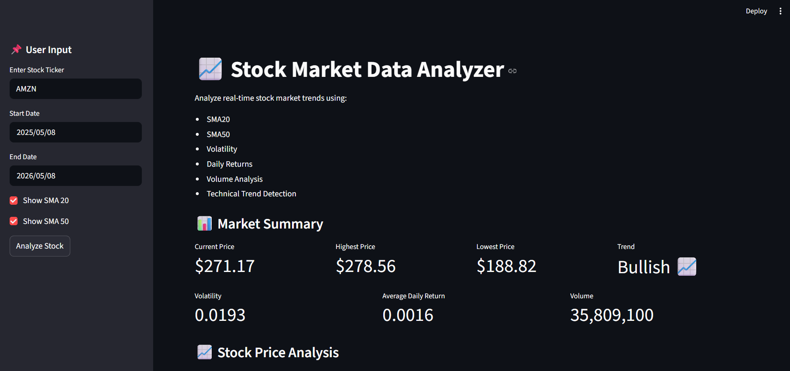
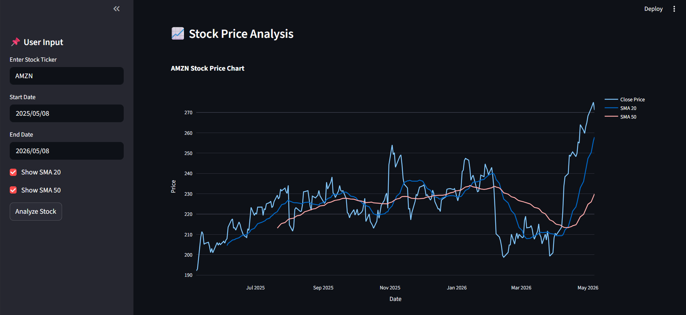

#  Stock Market Data Analyzer

Thia is a Python-based Stock Market Analytics Dashboard that fetches real stock market data using Yahoo Finance and performs financial analysis, technical analysis, risk analysis, and interactive visualization.

Built using:

- Python
- Streamlit
- Pandas
- NumPy
- Plotly
- yfinance

---

#  Features

##  Real-Time Stock Analysis

- Fetch real stock market data
- Analyze historical stock trends
- Compare stock movement over time

---

##  Technical Indicators

- SMA 20
- SMA 50
- Daily Returns
- Volatility Analysis
- Trend Detection

---

## Interactive Visualizations

- Stock Price Chart
- Moving Average Chart
- Return Distribution
- Volume Analysis

---

##  Risk Analysis

- Volatility Detection
- Bullish/Bearish Trend Analysis
- Market Performance Evaluation

---

##  Export Features

- Download processed CSV data
- Generate reports
- Save visualization charts

---

#  Tech Stack


- Python
- Core Programming
- Streamlit
- Dashboard UI 
- Pandas
- Data Analysis
- Numerical Computing 
- yfinance 
- Stock Market Data 
- Plotly 
- Interactive Charts 
- Matplotlib 
- Data Visualization 
- Statistical Charts 

---

#  Project Structure

```text
Stock-Market-Data-Analyzer/
│
├── data/
├── outputs/
├── reports/
├── src/
│   ├── data_collection.py
│   ├── analysis.py
│   ├── visualization.py
│   └── report_generator.py
│
├── dashboard.py
├── main.py
├── requirements.txt
├── .gitignore
└── README.md
```

---

#  Installation

## 1️ Clone Repository

```bash
git clone https://github.com/afrah-fks/Stock-Market-Data-Analyser.git
```

---

## 2️ Move Into Project Folder

```bash
cd Stock-Market-Data-Analyzer
```

---

## 3️ Create Virtual Environment

### Windows

```bash
python -m venv venv
```

Activate:

```bash
.\venv\Scripts\Activate.ps1
```

### Mac/Linux

```bash
python3 -m venv venv
source venv/bin/activate
```

---

## 4️ Install Requirements

```bash
pip install -r requirements.txt
```

---

# Run Project

## Run Streamlit Dashboard

```bash
streamlit run dashboard.py
```

---

#  Dashboard Features

 Stock Search  
 Date Range Selection  
 SMA20 & SMA50 Visualization  
 Risk Analysis  
 Volume Analysis  
 Interactive Charts  
 Download CSV Option  

---

#  Sample Stock Tickers

## US Stocks

```text
AAPL
TSLA
MSFT
NVDA
AMZN
```

## Indian Stocks

```text
INFY.NS
RELIANCE.NS
TCS.NS
HDFCBANK.NS
```

---

#  Screenshots

## Dashboard




---

## Stock Price Analysis




---

#  Future Improvements

- RSI Indicator
- MACD Indicator
- Candlestick Charts
- Portfolio Tracker
- Real-Time Alerts
- Machine Learning Prediction
- News Sentiment Analysis

---

#  Learning Outcomes

This project demonstrates:

- Financial Data Analysis
- Python Development
- Dashboard Development
- Data Visualization
- API Integration
- Technical Analysis
- Risk Analytics

---

